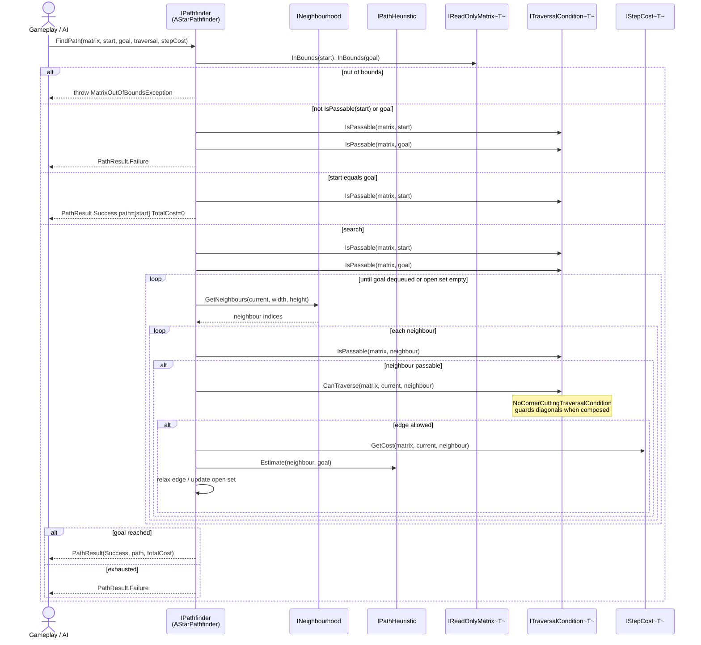

# Matrix module — diagrams

## Class diagram

```mermaid
classDiagram
    direction TB

    class MatrixIndex {
        +int X
        +int Y
        +MatrixIndex(int x, int y)
        +Equals(MatrixIndex other) bool
    }

    class MatrixRegion {
        +int X
        +int Y
        +int Width
        +int Height
        +MatrixRegion(int x, int y, int width, int height)
        +Contains(MatrixIndex index) bool
    }

    class ExpandPadding {
        +int Left
        +int Right
        +int Top
        +int Bottom
        +ExpandPadding(int left, int right, int top, int bottom)
    }

    class MatrixCell~T~ {
        +MatrixIndex Index
        +T Value
        +MatrixCell(MatrixIndex index, T value)
    }

    class IReadOnlyMatrix~T~ {
        <<interface>>
        +int Width
        +int Height
        +InBounds(MatrixIndex index) bool
        +Get(MatrixIndex index) T
        +TryGet(MatrixIndex index, out T value) bool
        +GetRow(int y) IReadOnlyList~T~
        +GetColumn(int x) IReadOnlyList~T~
        +GetRegion(MatrixRegion region) IReadOnlyList~T~
        +GetNeighbours(MatrixIndex index, INeighbourhood neighbourhood) IReadOnlyList~T~
        +Find(T value, out MatrixIndex index) bool
        +FindAll(T value) IReadOnlyList~MatrixIndex~
        +FindAll(Func~T,bool~ predicate) IReadOnlyList~MatrixIndex~
        +Enumerate() IEnumerable~MatrixCell~T~~
        +Count(Func~T,bool~ predicate) int
        +Any(Func~T,bool~ predicate) bool
        +All(Func~T,bool~ predicate) bool
    }

    class IMatrix~T~ {
        <<interface>>
        +Set(MatrixIndex index, T value)
        +TrySet(MatrixIndex index, T value) bool
        +Fill(T value)
        +FillRegion(MatrixRegion region, T value)
        +Clone() IMatrix~T~
        +Crop(MatrixRegion region) IMatrix~T~
        +Expand(ExpandPadding padding, T fillValue) IMatrix~T~
        +ExpandTo(int width, int height, MatrixIndex contentOrigin, T fillValue) IMatrix~T~
    }

    class Matrix~T~ {
        +Matrix(int width, int height, T fillValue)
        +Matrix(int width, int height, T[] rowMajorCells)
    }

    class MatrixOutOfBoundsException
    class InvalidMatrixRegionException

    class INeighbourhood {
        <<interface>>
        +GetNeighbours(MatrixIndex center, int width, int height) IReadOnlyList~MatrixIndex~
    }

    class OrthogonalNeighbourhood
    class EightWayNeighbourhood

    class ITraversalCondition~T~ {
        <<interface>>
        +IsPassable(IReadOnlyMatrix~T~ matrix, MatrixIndex cell) bool
        +CanTraverse(IReadOnlyMatrix~T~ matrix, MatrixIndex from, MatrixIndex to) bool
    }

    class PredicateTraversalCondition~T~ {
        +PredicateTraversalCondition(Func cellPassable, Func edgePassable)
    }

    class NoCornerCuttingTraversalCondition~T~ {
        +NoCornerCuttingTraversalCondition(ITraversalCondition~T~ inner)
    }

    class IStepCost~T~ {
        <<interface>>
        +GetCost(IReadOnlyMatrix~T~ matrix, MatrixIndex from, MatrixIndex to) float
    }

    class ConstantStepCost~T~ {
        +ConstantStepCost(float cost)
    }

    class OctileStepCost~T~ {
        +OctileStepCost()
    }

    class IPathHeuristic {
        <<interface>>
        +Estimate(MatrixIndex from, MatrixIndex to) float
    }

    class ManhattanHeuristic
    class OctileHeuristic

    class IPathfinder {
        <<interface>>
        +FindPath~T~(matrix, start, goal, traversal, stepCost) PathResult
    }

    class AStarPathfinder {
        +AStarPathfinder(INeighbourhood neighbourhood, IPathHeuristic heuristic)
    }

    class PathResult {
        +bool Success
        +IReadOnlyList~MatrixIndex~ Path
        +float TotalCost
        +PathResult Failure()$ PathResult
        +PathResult FromPath(path, totalCost)$ PathResult
    }

    IMatrix~T~ --|> IReadOnlyMatrix~T~
    Matrix~T~ ..|> IMatrix~T~
    OrthogonalNeighbourhood ..|> INeighbourhood
    EightWayNeighbourhood ..|> INeighbourhood
    PredicateTraversalCondition~T~ ..|> ITraversalCondition~T~
    NoCornerCuttingTraversalCondition~T~ ..|> ITraversalCondition~T~
    NoCornerCuttingTraversalCondition~T~ --> ITraversalCondition~T~ : decorates
    ConstantStepCost~T~ ..|> IStepCost~T~
    OctileStepCost~T~ ..|> IStepCost~T~
    ManhattanHeuristic ..|> IPathHeuristic
    OctileHeuristic ..|> IPathHeuristic
    AStarPathfinder ..|> IPathfinder

    IReadOnlyMatrix~T~ ..> MatrixIndex : uses
    IReadOnlyMatrix~T~ ..> MatrixRegion : uses
    IReadOnlyMatrix~T~ ..> MatrixCell~T~ : enumerates
    IReadOnlyMatrix~T~ ..> INeighbourhood : neighbour query
    IMatrix~T~ ..> ExpandPadding : uses
    IPathfinder ..> IReadOnlyMatrix~T~ : reads
    IPathfinder ..> ITraversalCondition~T~ : uses
    IPathfinder ..> IStepCost~T~ : uses
    IPathfinder ..> PathResult : returns
    AStarPathfinder --> INeighbourhood : ctor
    AStarPathfinder --> IPathHeuristic : ctor
    ITraversalCondition~T~ ..> IReadOnlyMatrix~T~ : reads
    IStepCost~T~ ..> IReadOnlyMatrix~T~ : reads
```

## Sequence diagram — main pathfinding flow

```mermaid
sequenceDiagram
    actor Consumer as Gameplay / AI
    participant PF as IPathfinder<br/>(AStarPathfinder)
    participant N as INeighbourhood
    participant H as IPathHeuristic
    participant M as IReadOnlyMatrix~T~
    participant T as ITraversalCondition~T~
    participant C as IStepCost~T~

    Consumer->>PF: FindPath(matrix, start, goal, traversal, stepCost)
    PF->>M: InBounds(start), InBounds(goal)
    alt out of bounds
        PF-->>Consumer: throw MatrixOutOfBoundsException
    else not IsPassable(start) or goal
        PF->>T: IsPassable(matrix, start)
        PF->>T: IsPassable(matrix, goal)
        PF-->>Consumer: PathResult.Failure
    else start equals goal
        PF->>T: IsPassable(matrix, start)
        PF-->>Consumer: PathResult Success path=[start] TotalCost=0
    else search
        PF->>T: IsPassable(matrix, start)
        PF->>T: IsPassable(matrix, goal)
        loop until goal dequeued or open set empty
            PF->>N: GetNeighbours(current, width, height)
            N-->>PF: neighbour indices
            loop each neighbour
                PF->>T: IsPassable(matrix, neighbour)
                alt neighbour passable
                    PF->>T: CanTraverse(matrix, current, neighbour)
                    Note over T: NoCornerCuttingTraversalCondition<br/>guards diagonals when composed
                    alt edge allowed
                        PF->>C: GetCost(matrix, current, neighbour)
                        PF->>H: Estimate(neighbour, goal)
                        PF->>PF: relax edge / update open set
                    end
                end
            end
        end
        alt goal reached
            PF-->>Consumer: PathResult(Success, path, totalCost)
        else exhausted
            PF-->>Consumer: PathResult.Failure
        end
    end
```
